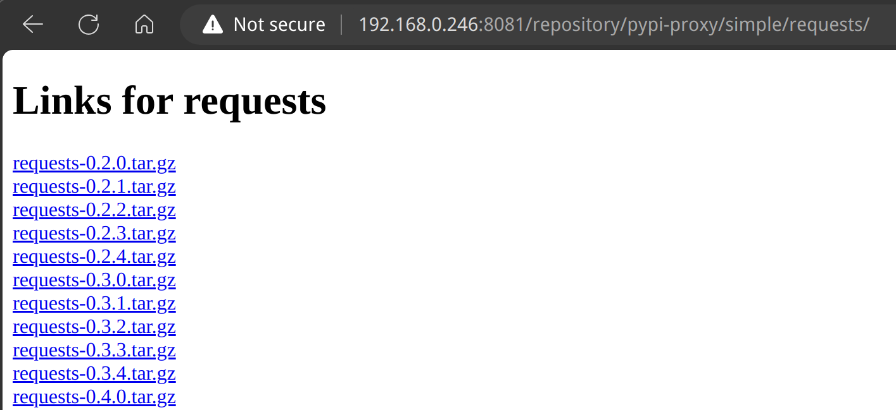
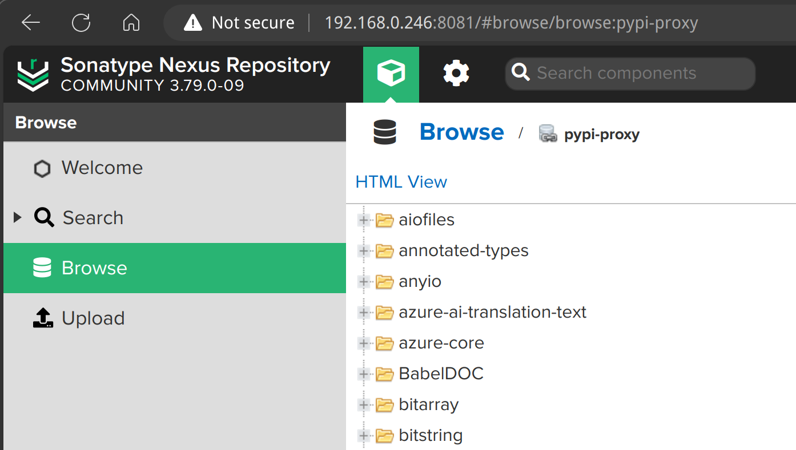

默认 pip 使用的是国外的镜像（疑似是 https://pypi.org/ ？），速度较慢。

## 升级 pip

安装完成后的 pip 版本：

```bash
pip3 --version      

pip 24.0 from /home/sky/.pyenv/versions/3.11.11/lib/python3.11/site-packages/pip (python 3.11)
```

升级 pip 到最新的版本：

```bash
python -m pip install --upgrade pip
```

输出为:

```bash
Looking in indexes: https://pypi.tuna.tsinghua.edu.cn/simple
Requirement already satisfied: pip in ./.pyenv/versions/3.11.11/lib/python3.11/site-packages (24.0)
Collecting pip
  Downloading https://pypi.tuna.tsinghua.edu.cn/packages/c9/bc/b7db44f5f39f9d0494071bddae6880eb645970366d0a200022a1a93d57f5/pip-25.0.1-py3-none-any.whl (1.8 MB)
     ━━━━━━━━━━━━━━━━━━━━━━━━━━━━━━━━━━━━━━━━ 1.8/1.8 MB 4.8 MB/s eta 0:00:00
Installing collected packages: pip
  Attempting uninstall: pip
    Found existing installation: pip 24.0
    Uninstalling pip-24.0:
      Successfully uninstalled pip-24.0
Successfully installed pip-25.0.1
```

升级之后的 pip 版本：

```bash
pip --version
pip 25.0.1 from /home/sky/.pyenv/versions/3.11.11/lib/python3.11/site-packages/pip (python 3.11)
```

## 配置国内镜像源

linux 下 pip 的配置文件路径是 `~/.pip/pip.conf` ：

```bash
mkdir -p ~/.pip

vi ~/.pip/pip.conf
```

windows 下 pip 的配置文件路径是 `~/pip/pip.ini` ：

```bash
mkdir -p ~/pip

vi ~/pip/pip.ini
```

配置的方式是一样的，输入内容：

```bash
[global]
index-url = https://pypi.tuna.tsinghua.edu.cn/simple
[install]
trusted-host = https://pypi.tuna.tsinghua.edu.cn
```

配置完成后检查：

```bash
pip3 config list 
```

正常应输出：

```bash
global.index-url='https://pypi.tuna.tsinghua.edu.cn/simple'
install.trusted-host='https://pypi.tuna.tsinghua.edu.cn'
```

### 其他国内源

备用：

- 清华大学TUNA镜像源： https://pypi.tuna.tsinghua.edu.cn/simple
- 阿里云镜像源： http://mirrors.aliyun.com/pypi/simple/
- 中国科学技术大学镜像源： https://mirrors.ustc.edu.cn/pypi/simple/
- 华为云镜像源： https://repo.huaweicloud.com/repository/pypi/simple/
- 腾讯云镜像源：https://mirrors.cloud.tencent.com/pypi/simple/

## 配置 nexus 代理源

### 创建代理仓库

在 nexus 中，创建 pypi proxy 仓库， 如：

- `pypi-proxy-pypiorg`： 代理地址为 https://pypi.org/
- `pypi-proxy-tsinghua`： 代理地址为 https://pypi.tuna.tsinghua.edu.cn/

> 备注： 特别注意代理地址不能带 `/simple` 后缀，否则会报错

验证代理是否可用，可以访问如下的地址:

http://192.168.3.91:8081/repository/pypi-proxy-pypiorg/simple/requests/

正常会显示如下：



> 备注： 如果代理地址中带 `/simple` 后缀，访问这个地址就会报错 404.

再创建一个名为 pypi-public 的 pypi group 仓库，将上面两个 pypi proxy 仓库加进去，顺序为：

- pypi-proxy-tsinghua
- pypi-proxy-pypiorg

以后对外都只使用 pypi-public 仓库，如果内部有什么改动如修改代理仓库为阿里云，就不会影响到外部的使用。

### 使用代理仓库

修改 pip 配置，设置为：

```bash
[global]
index-url = http://192.168.0.246:8081/repository/pypi-public/simple
[install]
trusted-host = 192.168.0.246:8081
```

尝试安装一个 pdf2zh 验证代理：

```bash
pip install pdf2zh
```

正常能看到从代理仓库下载：

```bash
Collecting shellingham>=1.3.0
  Downloading http://192.168.0.246:8081/repository/pypi-public/packages/shellingham/1.5.4/shellingham-1.5.4-py2.py3-none-any.whl (9.8 kB)
Collecting toposort>=1.5
  Downloading http://192.168.0.246:8081/repository/pypi-public/packages/toposort/1.10/toposort-1.10-py3-none-any.whl (8.5 kB)
Collecting click-default-group>=1.2
  Downloading http://192.168.0.246:8081/repository/pypi-public/packages/click-default-group/1.2.4/click_default_group-1.2.4-py2.py3-none-any.whl (4.1 kB)
```

安装完成之后再去验证 nexus pypi 代理仓库：

