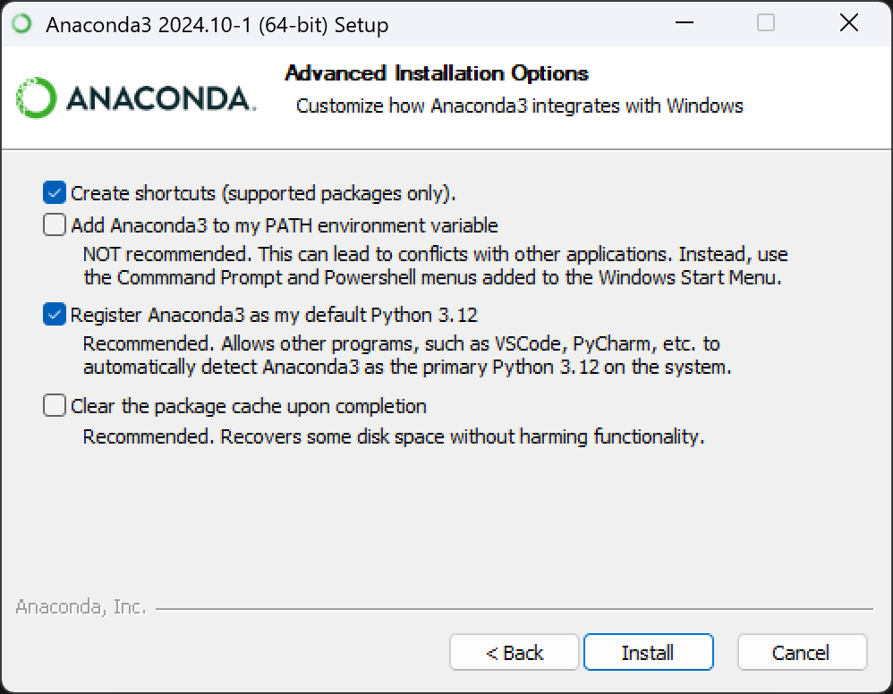

## anaconda 介绍

anaconda 是一个免费的 python 发行版本，包含很多常用的 python 库，官网地址：

https://www.anaconda.com/

anaconda 的官网说明：

> The Operating System for AI
> 
> The world’s most trusted open ecosystem for
> sourcing, building, and deploying data science and AI initiatives
>
> 为 AI 打造的操作系统
> 
> 全球最值得信赖的开放生态系统，用于
> 数据科学和 AI 的获取、构建和部署

## anaconda 安装

下载地址：

https://www.anaconda.com/download/#windows

下载 Anaconda3 Windows x86_64 安装文件如：

https://repo.anaconda.com/archive/Anaconda3-2024.10-1-Windows-x86_64.exe

安装时选择只为自己安装，然后选择安装路径 `D:\sky\work\soft\anaconda\`，设置采用默认选项：

## 安装 python

在 anaconda navigator 界面，点击 `Environments` 标签，点击 `Create` 按钮，选择 `Python 3.xx` 版本，点击 `Create` 按钮，创建一个名为 `xxxx` 的环境。

然后点名字后面的绿色三角符号，就可以打开一个 cmd 命令行终端，在这个终端中输入 `python --version` 就可以看到 python 的版本。

之后就可以在这个环境中使用 python 了。

